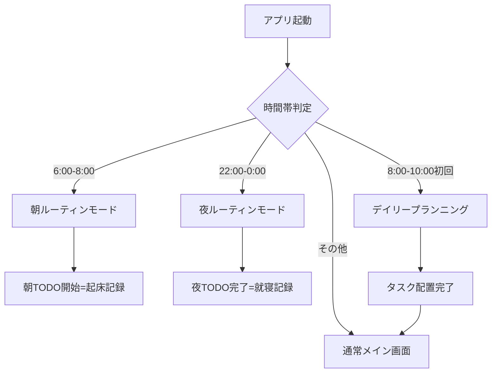

## デザインコンセプト

「認知負荷を最小限に、習慣化を最大限に」

- 時間帯に応じた最適な画面表示
- 視覚的な色分けによる直感的把握
- 強制フローによる習慣形成

## 完全版画面構成（9画面）

### **1. オンボーディング画面**

```
[初期設定フロー]
├── ウェルカム画面
├── 基本情報入力
│   ├── 名前
│   ├── 起床時間設定（例：7:00）
│   └── 就寝時間設定（例：23:00）
├── 場所登録
│   ├── 自宅住所
│   ├── 職場/学校住所
│   └── よく行く場所（最大3箇所）
├── ルーティン設定
│   ├── 朝のルーティン
│   │   ├── 洗顔・歯磨き（5分）
│   │   ├── 着替え（10分）
│   │   └── 朝食（20分）
│   └── 夜のルーティン
│       ├── 入浴（30分）
│       ├── スキンケア（10分）
│       └── 明日の準備（15分）
├── タスク傾向アンケート（10問）
└── 位置情報許可・完了画面

```

### **2. メイン画面（時間帯適応型）**

### **通常モード（日中）**

```
[今日のフォーカス画面]
├── ヘッダー
│   ├── 現在時刻（大）
│   ├── 達成率バー
│   └── モード表示
├── 現在のブロック（大表示）
│   ├── 実行中タスク/予定
│   ├── 残り時間
│   └── [完了][一時停止]
├── 次の予定（30分以内）
│   ├── 移動アラート付き
│   └── 準備開始通知
├── 今日のタスクリスト
└── ナビゲーションバー

```

### **ルーティンモード（起床前後1時間・就寝前後1時間）**

```
[ルーティン専用画面]★
├── ヘッダー
│   ├── 「おはよう/おやすみ」メッセージ
│   └── ルーティン進捗バー
├── ルーティンタスクのみ表示
│   ├── □ 洗顔・歯磨き
│   ├── □ 着替え
│   └── □ 朝食
├── 各タスク
│   ├── 大きなチェックボックス
│   ├── タスク名（大文字）
│   └── 目安時間
├── [開始]ボタン（最初のタスク開始=起床記録）
├── [完了]ボタン（全タスク完了=就寝記録）
└── 他のタスクは非表示★

```

### **3. デイリープランニング画面（朝の強制フロー）**

```
[今日の計画作成]
├── タイトル「今日の計画を立てましょう」
├── 2ペインレイアウト
│   ├── 左：未配置タスクリスト
│   │   ├── プロジェクト色付きカード
│   │   ├── 優先度★表示
│   │   ├── 予測時間
│   │   └── ドラッグハンドル
│   └── 右：今日のタイムライン
│       ├── 固定ブロック
│       │   ├── 睡眠（薄紫）
│       │   ├── 予定（青/緑）
│       │   └── 移動（グレー）
│       └── 配置可能エリア（点線）
├── [AI自動配置]ボタン
└── [計画確定]ボタン

```

### **4. スケジュール管理画面（カレンダービュー）**

```
[Googleカレンダー風ビュー]
├── 表示切替（日/週/月）
├── タイムライングリッド（0-24時）
│   ├── 睡眠ブロック
│   │   └── 色：#E8EAF6（薄紫）
│   ├── 予定ブロック
│   │   ├── 対面：#4A90E2（青）
│   │   ├── オンライン：#7ED321（緑）
│   │   └── 場所/URL表示
│   ├── 移動ブロック
│   │   ├── 色：#9E9E9E（グレー固定）
│   │   ├── 出発地→目的地
│   │   └── 予測/実績時間
│   └── タスクブロック
│       ├── プロジェクト色（70%透明度）
│       └── タスク名・時間
├── 現在時刻ライン（赤）
└── プロジェクト色凡例

```

### **5. タスク管理画面（Notionデータベース風）**

### **ビュー切替タブ**

```
[データベースビュー]
├── テーブルビュー
├── カンバンビュー
├── カレンダービュー
└── ガントチャート

```

### **テーブルビュー**

```
[列構成]
├── □ 選択
├── タスク名
├── プロジェクト●（色タグ）
├── 優先度★
├── 予測時間
├── 実績時間
├── 期限
├── ステータス
└── アクション

```

### **フィルター機能**

```
[フィルター設定]
├── 今日のタスク
├── プロジェクト選択（複数可）
├── 優先度（★★★/★★/★）
├── ステータス
└── カスタムフィルター保存

```

### **6. 予定追加/編集画面**

```
[予定入力フォーム]
├── タイトル
├── 日時
│   ├── 開始
│   └── 終了
├── 場所設定
│   ├── タイプ選択
│   │   ├── 対面（住所入力）
│   │   ├── オンライン（URL）
│   │   └── ハイブリッド
│   ├── 住所検索（Google Maps連携）
│   └── よく使う場所から選択
├── 移動時間
│   ├── 自動計算ON/OFF
│   ├── 準備時間（分）
│   └── バッファ時間（分）
└── [保存]

```

### **7. タスク実行画面**

```
[フォーカスモード]
├── タスク名（特大表示）
├── タイマー
│   ├── 経過時間
│   ├── 予定時間
│   └── 進捗バー
├── 位置情報ステータス
│   ├── 現在地確認
│   └── 移動検知
├── アクション
│   ├── [一時停止]
│   ├── [完了]
│   └── [中断]
└── 次の予定通知エリア

```

### **8. プロジェクト設定画面**

```
[プロジェクト管理]
├── プロジェクト一覧
│   ├── 名前
│   ├── カラーピッカー（10色）
│   ├── アイコン選択
│   └── タスク数表示
├── [新規プロジェクト作成]
└── デフォルト設定

```

### **9. デイリーレビュー画面**

```
[1日の振り返り]
├── 睡眠分析
│   ├── 就寝：夜ルーティン完了時刻
│   └── 起床：朝ルーティン開始時刻
├── 移動分析
│   ├── 総移動時間
│   └── 予測vs実績グラフ
├── タスク達成
│   ├── 完了率
│   └── プロジェクト別実績
├── 時間配分
│   └── 円グラフ（プロジェクト色）
└── 明日への提案

```

## カラーシステム完全版

### **システムカラー（変更不可）**

```scss
// 基本色
$background: #F8F9FA;
$text-primary: #2C3E50;
$text-secondary: #7F8C8D;

// ブロックタイプ別
$sleep: #E8EAF6;        // 睡眠
$appointment-f2f: #4A90E2;   // 対面予定
$appointment-online: #7ED321; // オンライン
$travel: #9E9E9E;       // 移動（固定）
$routine: #FFE5B4;      // ルーティン

// 状態色
$current-time: #FF5252;  // 現在時刻
$alert: #F5A623;        // アラート
$success: #7ED321;      // 完了

```

### **プロジェクトカラー（ユーザー選択）**

```scss
$project-palette: (
  red: #FF6B6B,
  orange: #FF9F40,
  yellow: #FFD93D,
  green: #6BCF7F,
  teal: #4ECDC4,
  blue: #4D96FF,
  purple: #9B59B6,
  pink: #FF6B9D,
  brown: #A67B5B,
  gray: #95A5A6
);

```

## ⏰ 時間帯別モード切替ロジック

### **ルーティンモード発動条件**

```jsx
// 設定値
const wakeUpTime = "07:00";
const bedTime = "23:00";

// ルーティンモード判定
function isRoutineMode(currentTime) {
  const morning = {
    start: wakeUpTime - 60分,  // 06:00
    end: wakeUpTime + 60分     // 08:00
  };

  const night = {
    start: bedTime - 60分,      // 22:00
    end: bedTime + 60分         // 00:00
  };

  return isInRange(morning) || isInRange(night);
}

// モード切替
if (isRoutineMode) {
  showRoutineOnlyView();  // ルーティンタスクのみ表示
} else {
  showNormalView();       // 通常のタスク表示
}

```

### **画面遷移フロー**



## 位置情報活用機能

### **移動時間自動算出**

```tsx
interface TravelCalculation {
  origin: Coordinates;
  destination: Coordinates;
  departureTime: Date;
  mode: 'walking' | 'transit' | 'driving';

  // 算出結果
  baseDuration: number;      // 基本移動時間
  prepTime: number;          // 準備時間
  bufferTime: number;        // バッファ
  totalDuration: number;     // 合計
  suggestedDeparture: Date;  // 出発推奨時刻
}

```

### **GPS追跡機能**

```tsx
interface LocationTracking {
  // リアルタイム追跡
  currentLocation: Coordinates;
  movementStatus: 'stationary' | 'moving' | 'arrived';

  // 自動記録
  actualDeparture: Date;
  actualArrival: Date;
  actualDuration: number;

  // 学習データ
  averageDelay: number;
  frequentRoutes: Route[];
}

```

## コンポーネント設計詳細

### **ルーティンタスクカード（特大サイズ）**

```scss
.routine-task-card {
  height: 80px;  // 通常の2倍
  font-size: 24px;
  background: linear-gradient(135deg, #FFE5B4, #FFF8E1);

  .checkbox {
    width: 40px;
    height: 40px;
  }

  .time-badge {
    font-size: 18px;
    opacity: 0.8;
  }
}

```

### **プロジェクト色タスクブロック**

```scss
.task-block {
  background-color: var(--project-color);
  opacity: 0.7;
  border-left: 4px solid var(--project-color);

  &:hover {
    opacity: 0.9;
  }
}

```

## 実装優先順位（MVP版）

### **Phase 1（必須）**

1. ルーティンモード切替
2. デイリープランニング強制フロー
3. プロジェクトカラーシステム
4. 位置情報による移動時間算出

### **Phase 2（重要）**

1. GPS追跡と実績記録
2. Notionライクなデータベースビュー
3. AI自動配置

### **Phase 3（拡張）**

1. 高度なフィルター
2. ガントチャート
3. 分析レポート