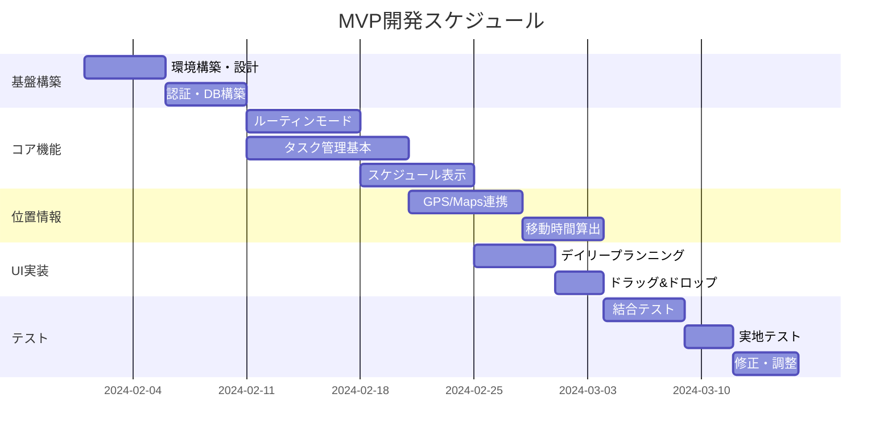

## 引き渡し資料パッケージ

### **1. 提供資料一覧**

### **必須資料（即日提供）**

```
📁 Formeet_MVP_開発資料_v1.0/
├── 📄 01_要件定義書.pdf
├── 📄 02_要件定義書_詳細版.docx（編集可能）
├── 🎨 03_Figmaリンク.txt（編集権限付き）
├── 📊 04_データ設計/
│   ├── ER図.pdf
│   ├── テーブル定義書.xlsx
│   └── サンプルデータ.sql
├── 📐 05_画面設計/
│   ├── 画面一覧.xlsx
│   ├── 画面遷移図.pdf
│   └── ワイヤーフレーム全画面.pdf
├── 🔌 06_API仕様/
│   ├── API仕様書.yaml（Swagger）
│   └── APIエンドポイント一覧.xlsx
└── 📋 07_プロジェクト管理/
    ├── WBS.xlsx
    ├── 優先順位表.xlsx
    └── 用語集.xlsx

```

### **補足資料（3日以内に提供）**

```
📁 補足資料/
├── ユーザーペルソナ詳細.pdf
├── 競合分析.xlsx
├── 技術選定理由書.pdf
└── テストシナリオ.xlsx

```

### **2. Figma引き渡し仕様**

### **Figmaプロジェクト構成**

```
🎨 Formeet Design System
├── 📁 01_Design System
│   ├── Colors（システム色・プロジェクト色）
│   ├── Typography（フォント定義）
│   ├── Components（共通コンポーネント）
│   └── Icons（アイコンセット）
├── 📁 02_Screens
│   ├── 00_Onboarding
│   ├── 01_Main_Normal
│   ├── 02_Main_Routine
│   ├── 03_Daily_Planning
│   ├── 04_Schedule
│   ├── 05_Task_Management
│   ├── 06_Task_Execution
│   ├── 07_Settings
│   └── 08_Review
├── 📁 03_User_Flows
│   ├── Morning_Routine_Flow
│   ├── Daily_Planning_Flow
│   └── Task_Execution_Flow
└── 📁 04_Prototype
    └── Interactive_Prototype_Link

```

### **デザイントークン**

```json
{
  "colors": {
    "system": {
      "sleep": "#E8EAF6",
      "appointment": "#4A90E2",
      "travel": "#9E9E9E",
      "routine": "#FFE5B4"
    },
    "projects": {
      "palette": ["#FF6B6B", "#FF9F40", "..."]
    }
  },
  "spacing": {
    "xs": 4,
    "sm": 8,
    "md": 16,
    "lg": 24,
    "xl": 32
  },
  "typography": {
    "heading": {
      "size": 24,
      "weight": "bold"
    },
    "body": {
      "size": 16,
      "weight": "regular"
    }
  }
}

```

## 初回打ち合わせアジェンダ

### **日時：契約後3営業日以内（2時間）**

### **1. プロジェクト概要説明（30分）**

```markdown
## 議題
1. ビジョンと背景の共有
   - 社会課題と解決アプローチ
   - ターゲットユーザーの特性
   - MVP後の展望

2. 成功指標の確認
   - KPIと測定方法
   - MVP版での最低限達成ライン

3. 開発スコープの確定
   - MVP必須機能の確認
   - Phase2以降の機能切り分け
   - 対象外事項の明確化

```

### **2. 技術仕様確認（45分）**

```markdown
## 技術検討事項
1. アーキテクチャの確認
   - React Native採用理由と代替案
   - バックエンド構成の妥当性
   - インフラ要件

2. 外部サービス連携
   - Google Maps API利用上限と費用
   - GPS精度と電池消費のバランス
   - プッシュ通知の実装方針

3. データベース設計
   - 位置情報データの保存方法
   - リアルタイム同期の仕組み
   - バックアップとリカバリー

```

### **3. UI/UX詳細確認（30分）**

```markdown
## デザイン確認事項
1. Figmaデータの確認
   - コンポーネント仕様
   - アニメーション要件
   - レスポンシブ対応範囲

2. 特殊UI要件
   - ドラッグ&ドロップの実装
   - 時間帯別モード切替
   - ルーティン専用画面

3. アクセシビリティ
   - 文字サイズ調整機能
   - カラーコントラスト
   - 音声読み上げ対応（将来）

```

### **4. 開発進行確認（15分）**

```markdown
## プロジェクト管理
1. 開発スケジュール
   - マイルストーン設定
   - デリバリータイミング
   - テスト期間

2. コミュニケーション体制
   - 定例会議の設定
   - 緊急連絡体制
   - レビュープロセス

3. 成果物と納品形式
   - ソースコード管理
   - ドキュメント形式
   - デプロイ方法

```

## ❓ 想定Q&A集

### **技術的な質問**

**Q: なぜReact Nativeを選択したのか？**

```
A:
1. iOS/Android両対応で開発効率が高い
2. ホットリロードで開発速度向上
3. 位置情報やプッシュ通知のライブラリが充実
4. 将来的なWeb版展開も視野に入れている

```

**Q: GPS常時追跡によるバッテリー消費は？**

```
A:
1. 移動予定の前後30分のみ高精度モード
2. それ以外は低頻度の位置確認
3. WiFi/Bluetooth併用で精度確保
4. ユーザーが手動でOFF可能

```

### **仕様に関する質問**

**Q: ルーティンモードの切替タイミングは固定？**

```
A:
1. 基本は設定時刻の前後1時間
2. ユーザーが時間帯をカスタマイズ可能
3. 手動での切替も可能
4. 学習により最適化（Phase2）

```

**Q: タスクの自動配置ロジックは？**

```
A:
優先順位：
1. 締切の近いタスク
2. 高優先度（★★★）
3. 短時間タスク（隙間時間活用）
4. 同一プロジェクトは連続配置
5. エネルギー使うタスクは午前

```

### **スコープに関する質問**

**Q: MVP版で削れる機能は？**

```
A:（優先度の低い順）
1. ガントチャート表示
2. 詳細な分析レポート
3. カレンダー月表示
4. 音声入力
ただし、ルーティンモードとGPS機能は必須

```

## 📊 開発スケジュール案

### **MVP開発（8週間）**



## 🔄 継続的なコミュニケーション計画

### **定例会議体**

|会議|頻度|参加者|目的|
|---|---|---|---|
|進捗定例|週1回|PM、開発リード|進捗確認、課題解決|
|デザインレビュー|週1回|デザイナー、フロントエンド|UI/UX確認|
|技術検討会|随時|エンジニア全員|技術課題の解決|
|ステークホルダー報告|隔週|全員|全体進捗共有|

### **コミュニケーションツール**

```yaml
Slack:
  channels:
    - #formeet-general    # 全体連絡
    - #formeet-dev       # 開発議論
    - #formeet-design    # デザイン確認
    - #formeet-urgent    # 緊急対応

GitHub:
  repositories:
    - formeet-app        # メインリポジトリ
    - formeet-backend    # API
    - formeet-docs       # ドキュメント

Jira:
  projects:
    - FORM              # タスク管理
  workflows:
    - ToDo → InProgress → Review → Done

```

## 引き渡しチェックリスト

### **開発側で準備いただくもの**

- [ ] 開発環境の構築
- [ ] Google Maps APIキーの取得
- [ ] Apple Developer/Google Play登録
- [ ] Firebaseプロジェクト作成
- [ ] テスト端末（iOS/Android各2台以上）

### **発注側で準備するもの**

- [ ] 各種アカウント情報の共有
- [ ] ブランドガイドライン
- [ ] テストユーザー（10名）の手配
- [ ] App Store/Google Play用素材

### **初回打ち合わせ後のアクション**

- [ ] 議事録の作成と共有（当日中）
- [ ] 不明点リストの作成（翌日）
- [ ] 追加資料の提供（3営業日以内）
- [ ] キックオフミーティングの設定

---

これで開発会社への引き渡し準備が完了しました。次のフェーズ（デザインデータ→アプリ化の指示）に進んでよろしいでしょうか？